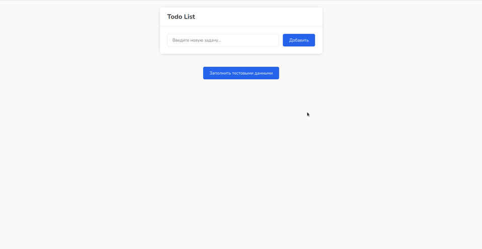

# Todo List

### List of tasks in vanilla JavaScript.

All functionality is implemented using HTML5 and pure JavaScript, no external platform or library is used.



[DEMO](https://alekstar79.github.io/todo-list)

## Particular

* If the task list is empty, you can fill it with test data.
* Tasks can be dragged and rearranged.
* Editing, deleting a task.
* Ability to delete completed tasks at once.
* Ability to select all tasks or deselect them all at once.
* Links in the text become clickable.
* Switch additional information with a button.
* The new task text field automatically changes height depending on the length of the text.
* In the text field of a new task, when pressing Ctrl + Enter, a new line is added.
* When the task editing modal window is open, Ctrl + Enter saves the task.
* The favicon displays the task counter.


**How to use:**

Just clone or download this repository and start local server

Clone this repo:
```shell
git clone git@github.com:alekstar79/todo-list.git
```
Go to project directory:
```shell
cd todo-list
```
Start server:
```shell
yarn run serve
```

or build bundle
````shell
yarn build
````
and start app
````shell
yarn run preview
````
